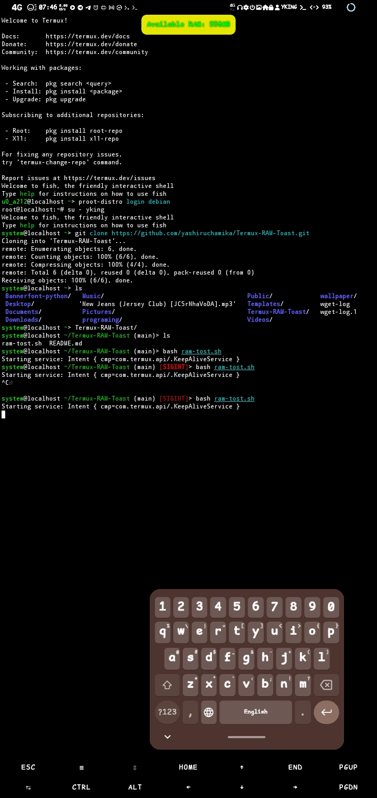
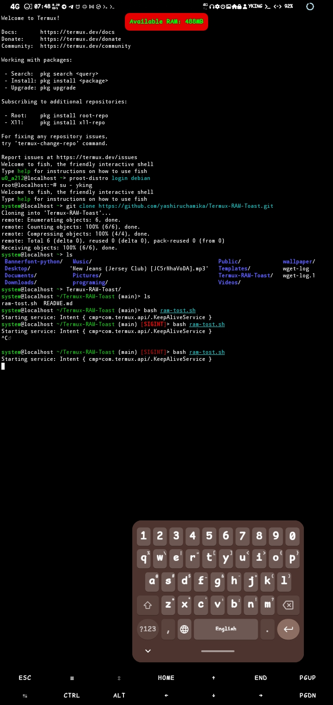

# Termux RAM Toaster 

A simple shell script for Termux that displays a toast notification showing the current RAM usage of your device. This script is useful for monitoring memory usage in real-time.

## Features

- Displays current RAM usage in a toast notification.
- Lightweight and easy to use.
- Customizable notification interval.

## Prerequisites

- [Termux]((https://github.com/termux/termux-app)) installed on your Android device.
- Basic knowledge of using the command line.
- Termux API installed on your Android device.

## Installation

1. **Install Termux**: Download and install Termux from the [Google Play Store](https://play.google.com/store/apps/details?id=com.termux) or [F-Droid](https://f-droid.org/packages/com.termux/).

2. **Clone the repository**:
   Open Termux and run the following command to clone this repository:

   ```bash
   git clone https://github.com/yashiruchamika/Termux-RAM-Toast.git
   cd Termux-RAM-Toast/
   bash ram-tost.sh

## Screenshots

Here are some screenshots of the Termux RAM Toast script in action:


*Toast notification showing RAM usage.*


*Another view of the script in action.*

   
